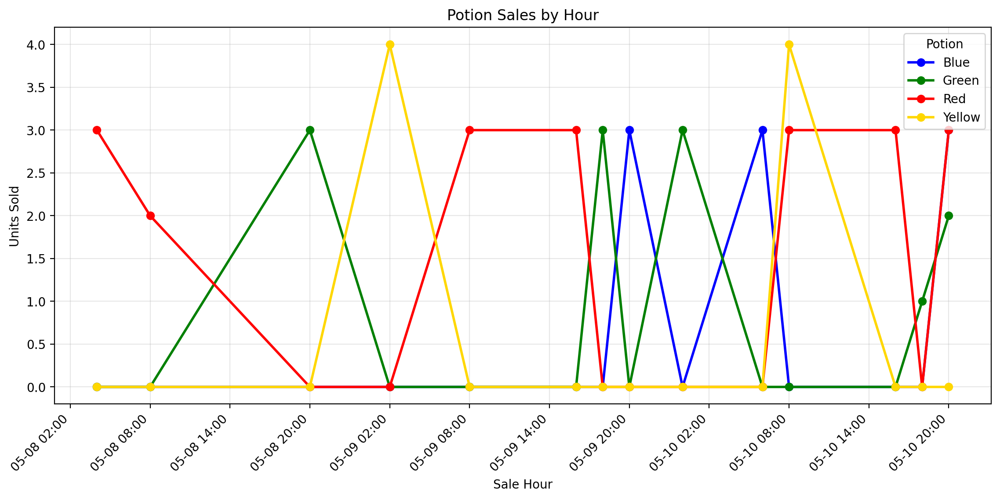
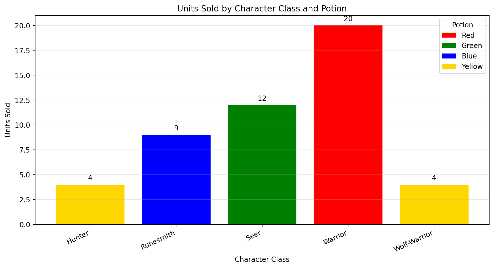
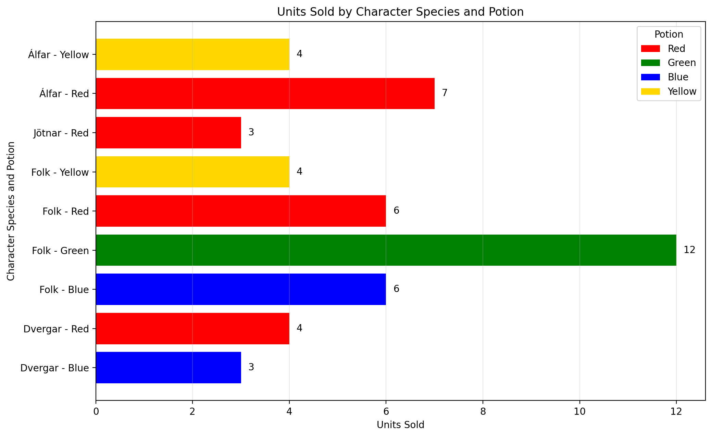
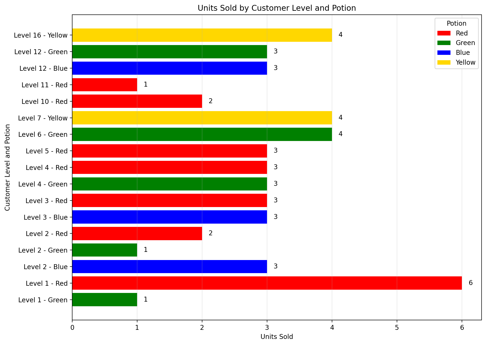
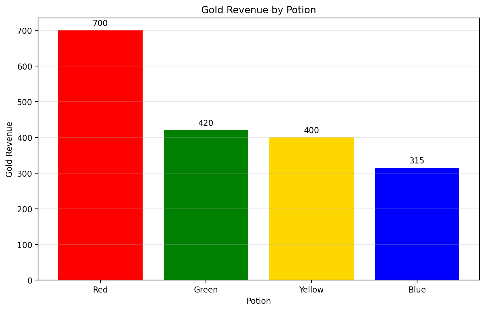

# Version 4 - Develop a Data-Driven Shop Strategy


## Metric 1 — Time series: sales per potion by hour

Checkout writes each line item to sale_events as(`potion_sku`, `quantity`, `sold_at`, plus `sold_day` / `sold_hour`). Join `potions` so I only chart SKUs that exist in my catalog.

### SQL — hourly timeline

Buckets sales by calendar hour using `sold_at` so the chart reads left to right through real time

```sql
SELECT
  date_trunc('hour', sale_events.sold_at) AS sale_hour,
  potions.sku,
  potions.name AS potion_name,
  SUM(sale_events.quantity) AS units_sold
FROM sale_events
JOIN potions ON potions.sku = sale_events.potion_sku
GROUP BY date_trunc('hour', sale_events.sold_at), potions.sku, potions.name
ORDER BY sale_hour, potions.sku;
```



### NOTE: I think it is important to note that all of my data and querries is based off my potion shop after it had been recently ish burned. Thus why I only have data for pure potions and yellow. 

### Interpretation:
The hourly sales chart shows that Red is the most consistently purchased potion across the observed time period, appearing in more sales hours than any other potion. Green also sells repeatedly, but less steadily, while Blue and Yellow appear in more isolated bursts. This suggests that Red is the safest potion to keep regularly stocked, while Blue and Yellow may be better treated as occasional and demand based products that do not need the same baseline inventory level.
---

## Metric 2 — Barrel types: offering time, liquid, cost per ml

Each time the simulator calls `POST /barrels/plan`, the newly implemented `barrel_catalog_offerings` table with one row per barrel line in that catalog is now tracked. `snapshot_at` is shared by every row in that request so when offered is the same timestamp for the whole menu.

### SQL — latest wholesale menu

```sql
WITH latest AS (
  SELECT MAX(snapshot_at) AS ts
  FROM barrel_catalog_offerings
)
SELECT
  sku AS barrel_type,
  snapshot_at AS offered_when,
  liquid_type,
  cost_per_ml AS cost_per_ml_gold,
  ml_per_barrel,
  price,
  catalog_quantity
FROM barrel_catalog_offerings
WHERE snapshot_at = (SELECT ts FROM latest)
ORDER BY sku;
```

### SQL — every captured catalog over time

```sql
SELECT
  sku AS barrel_type,
  snapshot_at AS offered_when,
  liquid_type,
  cost_per_ml AS cost_per_ml_gold
FROM barrel_catalog_offerings
ORDER BY snapshot_at DESC, sku;
```


### Interpretation:
This table helps compare barrel options by both timing and cost efficiency. The most important takeaway is which barrel types offer the lowest cost per ml for each liquid type, since these are the best candidates for improving margins when demand is strong enough to justify buying them. This metric is useful operationally because it connects purchasing decisions to profitability, if a cheaper barrel option lines up with a high demand liquid type, it should be prioritized.
---

## Metric 3 — Class, species, and level vs potion type

Checkout logs `character_class`, `character_species`, and `level` on each `sale_events` row. Join `potions` on `potion_sku` so potion type uses my catalog `name`

I also used `COALESCE(..., 'unknown')` so missing demographics from older rows do not drop out of the join

### SQL — units sold by character class and potion

```sql
SELECT
  COALESCE(sale_events.character_class, 'unknown') AS character_class,
  potions.name AS potion_name,
  SUM(sale_events.quantity) AS units_sold
FROM sale_events
JOIN potions ON potions.sku = sale_events.potion_sku
GROUP BY COALESCE(sale_events.character_class, 'unknown'), potions.name
ORDER BY character_class, potion_name;
```



### Interpretation:
The class based sales data suggests a strong relationship between character class and potion preference. In the current data, Warriors are the strongest buyers of Red, Seers favor Green, Runesmiths buy Blue, and Hunters / Wolf Warriors purchase Yellow. This indicates that potion demand is not random across customer classes, which means the shop could improve targeting by stocking and promoting specific potion types for the classes most likely to buy them.


### SQL — units sold by species and potion

```sql
SELECT
  COALESCE(sale_events.character_species, 'unknown') AS character_species,
  potions.name AS potion_name,
  SUM(sale_events.quantity) AS units_sold
FROM sale_events
JOIN potions ON potions.sku = sale_events.potion_sku
GROUP BY COALESCE(sale_events.character_species, 'unknown'), potions.name
ORDER BY character_species, potion_name;
```



### Interpretation:
The species based breakdown shows that Folk account for the broadest spread of purchases across potion types and appear to be the most varied customer group. Alfar currently lean toward Red and Yellow, Dvergar toward Blue and Red, and Jotnar only appear in Red purchases in the current dataset. This suggests that species may also be useful for segmentation, especially when deciding which potion assortments appeal to broader groups versus more specialized buyers.


### SQL — units sold by level and potion
```sql
SELECT
  sale_events.level AS customer_level,
  potions.name AS potion_name,
  SUM(sale_events.quantity) AS units_sold
FROM sale_events
JOIN potions ON potions.sku = sale_events.potion_sku
WHERE sale_events.level IS NOT NULL
GROUP BY sale_events.level, potions.name
ORDER BY customer_level, potion_name;
```



### Interpretation:
The level based chart shows that potion demand changes across customer levels rather than staying evenly distributed. Lower and mid level customers are more associated with Red and Green, while Yellow appears at higher levels such as 7 and 16, and Blue appears in more selective level ranges. This suggests that customer level may help predict potion preference, which could be useful when deciding which potions to emphasize for early game versus higher level buyers.

---


## Metric 4 — Gold revenue by potion 

### SQL — total gold revenue per potion type

```sql
SELECT
  potions.name AS potion_name,
  SUM(sale_events.quantity * sale_events.unit_price) AS gold_revenue
FROM sale_events
JOIN potions ON potions.sku = sale_events.potion_sku
GROUP BY potions.name
ORDER BY gold_revenue DESC;
```




### Interpretation:
The revenue chart shows that Red is currently the most valuable potion in total gold generated, producing 700 gold, well ahead of the others. Green and Yellow are in the middle, while Blue generates the least revenue so far. This matters because revenue is a stronger indicator of business value than units sold alone, and it suggests that at the time of me querring this data, Red should likely remain a priority product for both stocking and sales strategy. But this interpretation is based off a fairly early shop. I had recently just burned before querring all this data and feel that given another 3+ days of business the chart and results would drastically change such that my mixed potions, yellow, cyan, and purple were being sold more frequently and generating a much greater amount of revenue. 